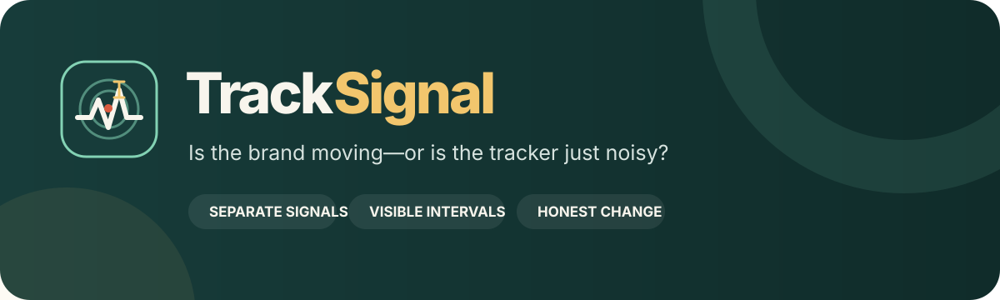

<p align="center">
  
</p>

<p align="center">
  
  
  <a href="LICENSE"></a>
</p>

<p align="center"><strong>Open brand-tracking evidence — keep measures separate, show uncertainty, and distinguish movement from noise.</strong></p>

> **Working-name status:** a basic screen on 17 July 2026 found no active company or software product using the exact name “TrackSignal.” That is encouraging, but it is not legal clearance or a trademark opinion. Keep the label provisional until official registers, company names, domains, package registries, app stores, and relevant jurisdictions have been professionally checked. See [the name screen](docs/name-screen.md).

**TrackSignal** is an open, local-first workbench for comparing brand-tracking survey measures across brands, segments, and waves. It asks:

> Is the brand becoming easier to notice, consider, choose, and remain loyal to—and are the observed changes larger than sampling noise and the declared practical threshold?

Everything runs locally with open-source Python packages. There is no account, telemetry, advertising, external AI call, remote database, cloud upload, or built-in persistence.

## Read this first

TrackSignal compares interpretable measures; it does **not** manufacture a universal “brand-equity score.”

- Awareness, familiarity, consideration, usage, loyalty, association strength, favourability, uniqueness, attribute ownership, trust, perceived quality, attachment, and reputation keep their own meaning and scale.
- Movement can reflect sampling variation, questionnaire or mode changes, weighting, coverage, seasonality, or real population change. The app estimates differences; it does not identify why they occurred.
- A tracking contrast is not a causal effect. Test interventions through **ExperimentSignal**.
- Multi-item construct scores require a recorded **MeasureSignal** or equivalent measurement-evidence reference. Perceptual maps, association geometry, and POP/POD reporting remain in **PositionSignal**.

## Try the fictional demo in three minutes

1. Start the app. Its deterministic fictional tracker is already loaded; no upload is required.
2. Open **Data & contract** and inspect the metric registry, measurement provenance, cell-size audit, and downloadable starter template.
3. Open **Current pulse** and choose one wave, segment, metric family, and metric. Read each brand estimate with its confidence interval.
4. Open **Change over time** and estimate the latest wave contrast. Read the difference and interval before the evidence-status label.
5. Open **Brand & segment compare** to inspect a brand contrast (paired only after you confirm the IDs identify the same people) or an independent segment contrast.
6. Open **Evidence pack** and export the auditable XLSX workbook.

The demonstration is generated by code for fictional brands and respondents. It represents no real person, organization, or empirical result. The downloadable demo CSV contains exactly the same data as the preloaded in-app demo.

## Data contract

Use long format: one row per respondent × wave × segment × brand × metric. CSV and XLSX are supported. Uploads are capped at 50 MB (workbooks additionally at 200 MB expanded, 500,000 rows, and 200 columns).

Required roles are respondent, wave, brand, metric, metric kind, and observed value. Segment, survey weight, metric family, measurement source, and practical-change threshold are optional, although a `construct` metric requires a measurement source.

Metric kinds are:

- `binary`: exactly 0 or 1; the estimate is a proportion;
- `rating`: a numeric single-item measure retained on its declared scale;
- `construct`: a numeric score created by a documented external measurement workflow.

The contract rejects duplicate respondent-wave-segment-brand-metric records, inconsistent metric definitions, nonpositive weights, nonbinary binary metrics, and undocumented construct scores. It never averages unlike metrics into one score. If no positive practical threshold is declared for a metric, the app says so and reports statistical detection only—it never promotes a bare significance test to a “clear” business change. See the [data guide](docs/data-guide.md).

## Methods and decision language

- Unweighted binary estimates use Wilson score intervals.
- Unweighted independent binary differences use the Newcombe–Wilson interval with a matching unpooled z test.
- Ratings and constructs use t intervals; independent differences use Welch’s approximation.
- Paired analysis is used only when you explicitly confirm that respondent IDs identify the same people in both groups and the IDs overlap. Overlapping IDs alone never trigger pairing, and paired rows report the pairs used and the respondents dropped from each group.
- Optional positive survey weights use an explicitly approximate Kish effective sample size, not a full complex-survey variance estimator.
- Benjamini–Hochberg q-values are calculated within each displayed contrast family.
- Wave labels are ordered numerically where they contain numbers (“Wave 2” before “Wave 10”); always check the displayed order against your fieldwork order.

A “clear increase” or “clear decrease” requires all three conditions: the confidence interval excludes zero, the BH q-value is at most .05, and the absolute change reaches the metric’s declared positive practical threshold. When no threshold is declared (or the declared value is zero), a detected change is labelled `DETECTED — NO PRACTICAL THRESHOLD DECLARED` instead. The estimate and interval remain primary; the label is an audit aid, not a verdict. See [methods](docs/methods.md) and the [decision guide](docs/decision-guide.md).

## Evidence pack

The XLSX evidence pack contains:

- release, name-status, interpretation, and source metadata;
- the metric registry and measurement provenance;
- cell sizes and effective sample sizes;
- separate metric estimates with confidence intervals;
- the latest wave, brand, or segment contrast, when one has been run;
- audit, summary, and contrast warnings.

All exported CSV and XLSX cells and headers are sanitized against spreadsheet formula injection. The workbook intentionally excludes a universal brand-equity score and never turns descriptive movement into a causal story.

## Run locally

You need Python 3.10 or newer and a local copy of this folder.

**macOS:** double-click `run_app.command`.

**Windows:** double-click `run_app.bat`.

The first launch creates a private `.venv` and downloads the open-source dependencies; later launches reuse it. Or use a terminal:

```bash
python3 -m venv .venv
source .venv/bin/activate  # Windows: .venv\Scripts\activate
python -m pip install -r requirements.txt
python -m streamlit run app.py
```

TrackSignal prefers local port `8586` and falls back to another free port on macOS. Set `TRACKSIGNAL_PORT` to choose a port, `TRACKSIGNAL_NO_BROWSER=1` to suppress browser opening, or `TRACKSIGNAL_DEBUG=1` to reveal unexpected technical error details.

### Docker

```bash
docker build -t tracksignal .
docker run --rm -p 8586:8586 tracksignal
```

Then open `http://127.0.0.1:8586`. The container runs as a non-root user and includes a health check.

## Privacy

Uploaded files are processed in the running Streamlit session. Deployment operators remain responsible for hosting logs, retention, access control, lawful basis, disclosure risk, and other legal obligations. Survey and brand data should still be minimized even when analysis is local. See [PRIVACY.md](PRIVACY.md).

## No install? Give this file to an AI

[AI_ANALYST.md](AI_ANALYST.md) is a standalone analysis protocol for a capable AI assistant. It carries the same scope limits, calculations, honesty rules, and output structure. The local app is the more private option: a cloud AI sees whatever you upload or paste.

## Development checks

```bash
python -m pip install -e ".[test]"
python -m pytest
python -m ruff check .
python -m build
```

The suite checks the data contract, interval calculations, paired and independent contrasts, explicit pairing confirmation, multiplicity and threshold rules, weighting warnings, natural wave ordering, deterministic examples, upload limits, formula-injection-safe evidence export, product boundaries, the shared application shell, and every Streamlit page.

## Relationship to the Signal suite

TrackSignal is part of the broader [Signal suite](https://ulrikerlingsen.com/): local-first, explainable marketing analytics tools with visible assumptions and auditable outputs.

- **MeasureSignal** establishes whether a multi-item score is defensible before that score is tracked.
- **TrackSignal** tracks separate brand measures and compares waves, brands, and segments.
- **PositionSignal** handles perceptual maps, association geometry, and POP/POD reporting; TrackSignal may track a prespecified attribute-ownership item over time.
- **DriverSignal** examines which measured experiences move with an outcome; **ExperimentSignal** tests randomized causal effects.
- **TextSignal** analyzes open-ended language patterns before any declared text-derived measure is tracked.

TrackSignal shares the suite’s local-first, named-method, fictional-demo, portable-evidence, and explicit-boundary standard.

## Academic independence and originality

TrackSignal is independently designed and written from public statistical and marketing literature. Its interface, analysis contract, examples, decision rules, prose, and code are original to this project. It does not reproduce lecture slides, notes, cases, exercises, diagrams, assessment material, datasets, questionnaire wording, or institution-specific frameworks; general topics encountered in education only define the problem domain. All bundled data are fictional and generated by code.

See [sources and originality](docs/sources-and-originality.md), [CONTRIBUTING.md](CONTRIBUTING.md), [SECURITY.md](SECURITY.md), and [CITATION.cff](CITATION.cff).

## License

The software and documentation are free under **AGPL-3.0-or-later**. See [LICENSE](LICENSE). The license covers this project’s expression, not ownership of the published statistical methods it implements.

This application was developed with AI coding assistance and checked through source review, analytical fixtures, deterministic synthetic recovery, automated app tests, and visual inspection. Verify material decisions independently; no warranty is provided.
