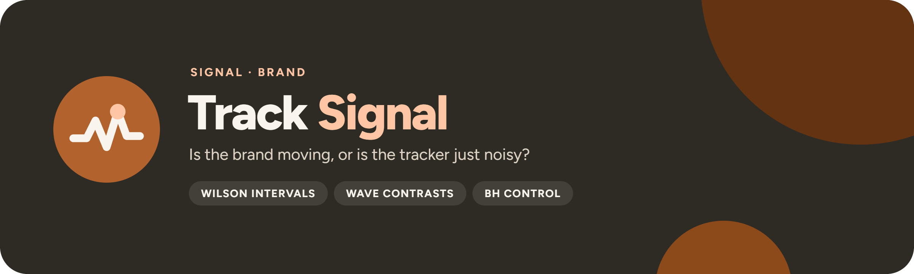

<p align="center">
  
</p>

<p align="center">
  <a href="https://github.com/UlrikErlingsen/brand-tracking/actions"></a>
  <a href="https://github.com/UlrikErlingsen/signal-hub"></a>
  
  
  <a href="LICENSE"></a>
</p>

<p align="center"><strong>Open brand-tracking evidence — keep measures separate, show uncertainty, and distinguish movement from noise.</strong></p>

**Track Signal** is an open, local-first workbench for comparing brand-tracking survey measures across brands, segments, and waves. It combines a declared tracking contract, separate per-metric estimates with confidence intervals, and uncertainty-aware wave, brand, and segment contrasts. It asks:

> Is the brand becoming easier to notice, consider, choose, and remain loyal to—and are the observed changes larger than sampling noise and the declared practical threshold?

Everything runs locally with open-source Python packages. There is no account, telemetry, advertising, external AI call, remote database, cloud upload, or built-in persistence.

## Read this first

Track Signal compares interpretable measures; it does **not** manufacture a universal “brand-equity score.”

- Awareness, familiarity, consideration, usage, loyalty, association strength, favourability, uniqueness, attribute ownership, trust, perceived quality, attachment, and reputation keep their own meaning and scale.
- Movement can reflect sampling variation, questionnaire or mode changes, weighting, coverage, seasonality, or real population change. The app estimates differences; it does not identify why they occurred.
- A tracking contrast is not a causal effect. Test interventions through **Experiment Signal**.
- Multi-item construct scores require a recorded **Measure Signal** or equivalent measurement-evidence reference. Perceptual maps, association geometry, and POP/POD reporting remain in **Position Signal**.

**Working-name status:** a basic screen on 17 July 2026 found no active company or software product using the exact name “TrackSignal” (written “Track Signal” since 1.1.0; the screen was not repeated for the spaced form). That is encouraging, but it is not legal clearance or a trademark opinion. Keep the label provisional until official registers, company names, domains, package registries, app stores, and relevant jurisdictions have been professionally checked. See [the name screen](docs/name-screen.md).

## Scope

**Version 1.1 supports:**

- long-format CSV and XLSX trackers: one row per respondent × wave × segment × brand × metric;
- `binary`, `rating`, and documented `construct` metrics, each estimated separately on its own scale;
- wave contrasts within a declared segment, brand contrasts within a wave and segment, and independent segment contrasts;
- paired analysis only after you confirm that respondent IDs identify the same people;
- optional positive survey weights through an explicitly approximate Kish effective sample size;
- Benjamini–Hochberg q-values and declared practical-change thresholds;
- an auditable XLSX evidence pack.

**It does not:** calculate a universal brand-equity score, identify why a measure moved, validate multi-item scales at item level, draw perceptual maps or association geometry, fit driver models, estimate causal effects, analyse open text, or model complex survey designs (strata, clusters, finite-population corrections, replicate weights). Where a sibling app covers it, use **[Measure Signal](https://github.com/UlrikErlingsen/measurement-validation)** for item-level validation, **[Position Signal](https://github.com/UlrikErlingsen/brand-positioning)** for perceptual maps and POP/POD work, **[Driver Signal](https://github.com/UlrikErlingsen/survey-driver-analysis)** for driver models, **[Experiment Signal](https://github.com/UlrikErlingsen/experiment-analysis)** for randomized causal effects, and **[Text Signal](https://github.com/UlrikErlingsen/open-text-analysis)** for text-derived measures.

## Try the demo in three minutes

1. Start the app. Its deterministic fictional tracker is already loaded; no upload is required.
2. Open **Data & contract** and inspect the metric registry, measurement provenance, cell-size audit, and downloadable starter template.
3. Open **Current pulse** and choose one wave, segment, metric family, and metric. Read each brand estimate with its confidence interval.
4. Open **Change over time** and estimate the latest wave contrast. Read the difference and interval before the evidence-status label.
5. Open **Brand & segment compare** to inspect a brand contrast (paired only after you confirm the IDs identify the same people) or an independent segment contrast.
6. Open **Evidence pack** and export the auditable XLSX workbook.

The demonstration is generated by code for fictional brands and respondents. It represents no real person, organization, or empirical result. The downloadable demo CSV contains exactly the same data as the preloaded in-app demo.

## Data contract

Use long format: one row per respondent × wave × segment × brand × metric. CSV and XLSX are supported.

Required roles are respondent, wave, brand, metric, metric kind, and observed value. Segment, survey weight, metric family, measurement source, and practical-change threshold are optional, although a `construct` metric requires a measurement source.

| respondent_id | wave | segment | brand | metric | metric_kind | family | value | weight | practical_threshold | measurement_source |
|---|---|---|---|---|---|---|---|---|---|---|
| W1-0001 | 2025 Q3 | Light category buyers | Northstar | Awareness | binary | Funnel | 0 | 0.88544 | 0.03 | Single tracker item; fictional wording owned by the example author |
| W1-0001 | 2025 Q3 | Light category buyers | Northstar | Attachment construct | construct | Relationship | 4.4706 | 0.88544 | 0.2 | MeasureSignal evidence pack MS-DEMO-001; synthetic demonstration only |

Metric kinds are:

- `binary`: exactly 0 or 1; the estimate is a proportion;
- `rating`: a numeric single-item measure retained on its declared scale;
- `construct`: a numeric score created by a documented external measurement workflow.

The contract rejects duplicate respondent-wave-segment-brand-metric records, inconsistent metric definitions, nonpositive weights, nonbinary binary metrics, and undocumented construct scores. It never averages unlike metrics into one score. The fictional tracker and a starter template are in [`examples/`](examples/). See the [data guide](docs/data-guide.md).

### Data limits

Run on your own computer (standalone, a local Signal Hub, or an internal company deployment), Track Signal has **no built-in limit** on file size, rows, or columns: your computer's memory is the limit. Streamlit's uploader accepts files up to 10,000 MB; set `TRACKSIGNAL_MAX_UPLOAD_MB` before launching `run_app.bat` or `run_app.command` to change that, or `STREAMLIT_SERVER_MAX_UPLOAD_SIZE` for Docker (the image sets 10000). If a file does not fit in memory, the app says so instead of crashing.

Validation, estimates, and contrasts are vectorized and aggregate per wave × segment × brand × metric cell, so no step samples the data. Measured on a 5,000,000-row, 490 MB tracker (6,000 cells): reading about 2.5 s, validation about 4 s, all cell estimates about 1 s, and a wave contrast under 0.5 s, with about 1.1 GB peak memory including the uploaded file; a compact 20,000,000-row file validates in about 21 s with 3.6 GB peak memory. Text columns are stored as categories after upload, which keeps repeated wave, brand, and metric labels compact. Tips for very large files: upload CSV rather than XLSX (a sheet stops at Excel's 1,048,576 rows and parses slowly), keep only the columns the contract needs, and split very large trackers by wave if memory runs short.

The public demo (Signal Hub's public image, `SIGNAL_PUBLIC=1`) protects its shared server with demo limits: 50 MB uploads, 200 MB expanded workbooks, 500,000 rows, and 200 columns. The downloaded app has none of these limits.

## Analysis contract

Declare what each column and metric means before looking at movement. The app records these declarations with the validated data and carries them into every estimate, contrast, and export:

- **Column roles** for respondent, wave, segment, brand, metric, metric kind, value, family, weight, measurement source, and practical threshold.
- **Measurement source** for every `construct` score, so a multi-item score is never tracked without its validation reference.
- **Practical-change threshold** on each metric’s own scale. If no positive practical threshold is declared for a metric, the app says so and reports statistical detection only—it never promotes a bare significance test to a “clear” business change.
- **Pairing confirmation**: a checkbox (off by default) that respondent IDs identify the same people in both groups. Overlapping IDs alone never trigger pairing.

The [starter template](examples/tracksignal-starter-template.csv) shows the expected columns.

## Methods

- Unweighted binary estimates use Wilson score intervals.
- Unweighted independent binary differences use the Newcombe–Wilson interval with a matching unpooled z test.
- Ratings and constructs use t intervals; independent differences use Welch’s approximation.
- Paired analysis is used only when you explicitly confirm that respondent IDs identify the same people in both groups and the IDs overlap. Overlapping IDs alone never trigger pairing, and paired rows report the pairs used and the respondents dropped from each group. For unweighted paired binary data the p-value comes from the exact McNemar test while the interval uses a paired-difference approximation; the method column labels this hybrid.
- Optional positive survey weights use an explicitly approximate Kish effective sample size, not a full complex-survey variance estimator.
- Benjamini–Hochberg q-values are calculated within each displayed contrast family.
- Wave labels are ordered numerically where they contain numbers (“Wave 2” before “Wave 10”); always check the displayed order against your fieldwork order.

See [methods](docs/methods.md).

## Decision statuses

A “clear increase” or “clear decrease” requires all three conditions: the confidence interval excludes zero, the BH q-value is at most .05, and the absolute change reaches the metric’s declared positive practical threshold. The estimate and interval remain primary; the label is an audit aid, not a verdict.

- **CLEAR INCREASE** / **CLEAR DECREASE**: direction, multiplicity, and the declared positive practical threshold align.
- **DETECTED — NO PRACTICAL THRESHOLD DECLARED**: the interval excludes zero and the q-value survives BH control, but no positive threshold was declared (or the declared value is zero), so business relevance cannot be judged.
- **CLEAR BUT BELOW PRACTICAL THRESHOLD**: direction is statistically clear, but the estimate is smaller than the declared threshold.
- **NOT ROBUST TO MULTIPLE-COMPARISON CONTROL**: the unadjusted interval excludes zero, but the result does not survive BH adjustment.
- **UNCERTAIN / COMPATIBLE WITH NO CHANGE**: the interval includes zero.
- **INSUFFICIENT PRECISION**: there is not enough information for a usable interval or p-value.

See the [decision guide](docs/decision-guide.md).

## Exports

The XLSX evidence pack contains:

- release, name-status, interpretation, and source metadata;
- the metric registry and measurement provenance;
- cell sizes and effective sample sizes;
- separate metric estimates with confidence intervals;
- the latest wave, brand, or segment contrast, when one has been run;
- audit, summary, and contrast warnings.

The wave contrast can also be downloaded as CSV. All exported CSV and XLSX cells and headers are sanitized against spreadsheet formula injection. The workbook intentionally excludes a universal brand-equity score and never turns descriptive movement into a causal story.

## Run locally

You need Python 3.10 or newer and a local copy of this folder.

**macOS:** double-click `run_app.command`. **Windows:** double-click `run_app.bat`.

The first launch creates a private `.venv` and downloads the open-source dependencies; later launches reuse it. Or use a terminal:

```bash
python3 -m venv .venv
source .venv/bin/activate  # Windows: .venv\Scripts\activate
python -m pip install -r requirements.txt
python -m streamlit run app.py
```

Track Signal prefers local port `8586` and falls back to another free port on macOS. Set `TRACKSIGNAL_PORT` to choose a port, `TRACKSIGNAL_MAX_UPLOAD_MB` to change the upload limit (default 10000), `TRACKSIGNAL_NO_BROWSER=1` to suppress browser opening, or `TRACKSIGNAL_DEBUG=1` to reveal unexpected technical error details.

### Docker

```bash
docker build -t tracksignal .
docker run --rm -p 8586:8586 tracksignal
```

Then open `http://127.0.0.1:8586`. The container runs as a non-root user and includes a health check. The image sets `STREAMLIT_SERVER_MAX_UPLOAD_SIZE=10000` (MB); pass `-e STREAMLIT_SERVER_MAX_UPLOAD_SIZE=…` to change it, and `-e SIGNAL_PUBLIC=1` only for a public demo with demo limits.

## Privacy

Uploaded files are processed in the running Streamlit session. Deployment operators remain responsible for hosting logs, retention, access control, lawful basis, disclosure risk, and other legal obligations. Survey and brand data should still be minimized even when analysis is local. See [PRIVACY.md](PRIVACY.md).

## No install? Give this file to an AI

[AI_ANALYST.md](AI_ANALYST.md) is a standalone analysis protocol for a capable AI assistant. It carries the same scope limits, calculations, honesty rules, and output structure. The local app is the more private option: a cloud AI sees whatever you upload or paste.

## Development

```bash
python -m pip install -e ".[test]"
python -m pytest
python -m ruff check .
python -m build
```

The analysis core (`tracksignal`) installs without Streamlit or Plotly; the app needs the `ui` extra (`python -m pip install -e ".[ui]"`), and `requirements.txt` lists everything for the launchers and Docker. [Signal Hub](https://github.com/UlrikErlingsen/signal-hub) embeds the app through `tracksignal.ui.render()`.

The suite checks the data contract, interval calculations, paired and independent contrasts, explicit pairing confirmation, multiplicity and threshold rules, weighting warnings, natural wave ordering, deterministic examples, upload limits, formula-injection-safe evidence export, product boundaries, the shared Signal shell, every Streamlit page, and the Signal Hub contract (no Streamlit import outside `ui/`, `render()` without a page config, namespaced keys).

## Where this fits in Signal

Track Signal is part of the broader Signal suite: local-first, explainable marketing analytics tools with visible assumptions and auditable outputs. It shares the suite’s local-first, named-method, fictional-demo, portable-evidence, and explicit-boundary standard.

- **Measure Signal** establishes whether a multi-item score is defensible before that score is tracked.
- **Track Signal** tracks separate brand measures and compares waves, brands, and segments.
- **Position Signal** handles perceptual maps, association geometry, and POP/POD reporting; Track Signal may track a prespecified attribute-ownership item over time.
- **Driver Signal** examines which measured experiences move with an outcome; **Experiment Signal** tests randomized causal effects.
- **Text Signal** analyzes open-ended language patterns before any declared text-derived measure is tracked.

<!-- signal-suite:start (generated from signal-hub/apps.yaml by scripts/sync_readme_suite.py) -->
| Family | App | Asks |
|---|---|---|
| Brand | **Track Signal** (this app) | Is the brand moving, or is the tracker just noisy? |
| Brand | [Position Signal](https://github.com/UlrikErlingsen/brand-positioning) | Where do brands sit relative to competitors? |
| Market | [Prospect Signal](https://github.com/UlrikErlingsen/b2b-prospecting) | Which Norwegian companies fit your ideal customer, and which first? |
| Market | [Listen Signal](https://github.com/UlrikErlingsen/media-listening) | Who is talking about the brand in Norwegian media, and in what tone? |
| Market | [Influence Signal](https://github.com/UlrikErlingsen/influencer-campaigns) | Which creators delivered, and was every post labelled properly? |
| Market | [Season Signal](https://github.com/UlrikErlingsen/marketing-calendar) | What does the Norwegian marketing year look like, worked backwards? |
| Market | [Adopt Signal](https://github.com/UlrikErlingsen/adoption-forecasting) | When will a new product be adopted? |
| Market | [Rival Signal](https://github.com/UlrikErlingsen/competitor-analysis) | Which rivals matter, and how could they respond? |
| Market | [Reach Signal](https://github.com/UlrikErlingsen/location-catchment-analysis) | Where could a new location reach, and how would it share demand with existing sites? |
| Customer | [Worth Signal](https://github.com/UlrikErlingsen/customer-value-analytics) | What are customers and relationships worth? |
| Customer | [Segment Signal](https://github.com/UlrikErlingsen/customer-segmentation) | Do customers form stable, useful groups? |
| Customer | [Trace Signal](https://github.com/UlrikErlingsen/journey-path-analysis) | How do logged customer journeys actually unfold? |
| Customer | [Blueprint Signal](https://github.com/UlrikErlingsen/service-blueprinting) | How is the customer experience actually delivered, and where do the handoffs fail? |
| Customer | [Recommend Signal](https://github.com/UlrikErlingsen/recommender-evaluation) | Which recommendation policy should be tested live? |
| Research | [Choice Signal](https://github.com/UlrikErlingsen/conjoint-analysis) | How do product attributes drive choice? |
| Research | [Driver Signal](https://github.com/UlrikErlingsen/survey-driver-analysis) | Which measured experiences move with satisfaction? |
| Research | [Measure Signal](https://github.com/UlrikErlingsen/measurement-validation) | Does a multi-item score have a defensible structure? |
| Research | [Text Signal](https://github.com/UlrikErlingsen/open-text-analysis) | What recurring patterns appear in open-ended responses? |
| Research | [Tag Signal](https://github.com/UlrikErlingsen/pricing-analysis) | What price range is supported, and how does profit move? |
| Research | [Learn Signal](https://github.com/UlrikErlingsen/research-prioritization) | Which uncertainty is worth paying to research before you decide? |
| Decide | [Experiment Signal](https://github.com/UlrikErlingsen/experiment-analysis) | Did the treatment cause a practically meaningful change? |
| Decide | [Gate Signal](https://github.com/UlrikErlingsen/launch-decision-gate) | Does a concept deserve the next investment? |
| Decide | [Shift Signal](https://github.com/UlrikErlingsen/cannibalization-analysis) | Does a launch grow the portfolio, or move existing demand around? |
| Decide | [Alloc Signal](https://github.com/UlrikErlingsen/marketing-mix-allocation) | Where should the next marketing budget go? |

All 24 apps run side by side in [Signal Hub](https://github.com/UlrikErlingsen/signal-hub), each opening with fictional demo data. Every repo carries the [`signal-suite`](https://github.com/topics/signal-suite) topic, and the suite is listed at [ulrikerlingsen.com](https://ulrikerlingsen.com). Freddo CRM is a separate product.
<!-- signal-suite:end -->

## References

Brand and measurement literature:

- Keller, K. L. (1993). Conceptualizing, measuring, and managing customer-based brand equity. *Journal of Marketing, 57*(1), 1–22. https://doi.org/10.1177/002224299305700101
- Chaudhuri, A., & Holbrook, M. B. (2001). The chain of effects from brand trust and brand affect to brand performance: The role of brand loyalty. *Journal of Marketing, 65*(2), 81–93. https://doi.org/10.1509/jmkg.65.2.81.18255
- Netemeyer, R. G., Krishnan, B., Pullig, C., Wang, G., Yagci, M., Dean, D., Ricks, J., & Wirth, F. (2004). Developing and validating measures of facets of customer-based brand equity. *Journal of Business Research, 57*(2), 209–224. https://doi.org/10.1016/S0148-2963(01)00303-4
- Steenkamp, J.-B. E. M., & Baumgartner, H. (1998). Assessing measurement invariance in cross-national consumer research. *Journal of Consumer Research, 25*(1), 78–90. https://doi.org/10.1086/209528

Statistical literature:

- Wilson, E. B. (1927). Probable inference, the law of succession, and statistical inference. *Journal of the American Statistical Association, 22*(158), 209–212. https://doi.org/10.1080/01621459.1927.10502953
- Welch, B. L. (1947). The generalization of “Student’s” problem when several different population variances are involved. *Biometrika, 34*(1/2), 28–35. https://doi.org/10.1093/biomet/34.1-2.28
- Newcombe, R. G. (1998). Interval estimation for the difference between independent proportions: Comparison of eleven methods. *Statistics in Medicine, 17*(8), 873–890. https://doi.org/10.1002/(SICI)1097-0258(19980430)17:8%3C873::AID-SIM779%3E3.0.CO;2-I
- Kish, L. (1965). *Survey Sampling*. Wiley.
- Benjamini, Y., & Hochberg, Y. (1995). Controlling the false discovery rate: A practical and powerful approach to multiple testing. *Journal of the Royal Statistical Society: Series B, 57*(1), 289–300. https://doi.org/10.1111/j.2517-6161.1995.tb02031.x

## Originality and license

Track Signal is independently designed and written from public statistical and marketing literature. Its interface, analysis contract, examples, decision rules, prose, and code are original to this project. It does not reproduce lecture slides, notes, cases, exercises, diagrams, assessment material, datasets, questionnaire wording, or institution-specific frameworks; general topics encountered in education only define the problem domain. All bundled data are fictional and generated by code.

See [sources and originality](docs/sources-and-originality.md), [CONTRIBUTING.md](CONTRIBUTING.md), [SECURITY.md](SECURITY.md), and [CITATION.cff](CITATION.cff).

The software and documentation are free under **AGPL-3.0-or-later**. See [LICENSE](LICENSE). The license covers this project’s expression, not ownership of the published statistical methods it implements.

This application was developed with AI coding assistance and checked through source review, analytical fixtures, deterministic synthetic recovery, automated app tests, and visual inspection. Verify material decisions independently; no warranty is provided.

---

<p>
  
  <strong>Track Signal</strong> is part of <a href="https://github.com/UlrikErlingsen/signal-hub"><strong>Signal</strong></a>, open marketing-evidence tools by <a href="https://ulrikerlingsen.com">Ulrik Erlingsen</a>.
</p>
